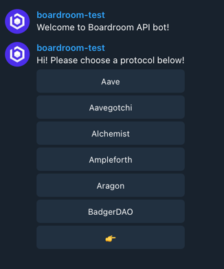
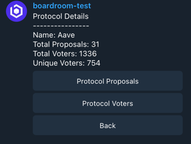
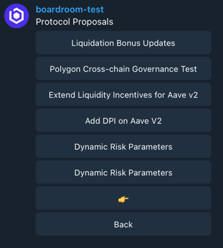

# Boardroom Governance Telegram Bot

## Testing the bot
1. Create telegram bot using BotFather
2. Configure .env file in the project root using bot token(see .env.example)
3. ```npm install```
4. ```npm start```
5. Run ```/start``` command in bot

## Some Visual Examples



